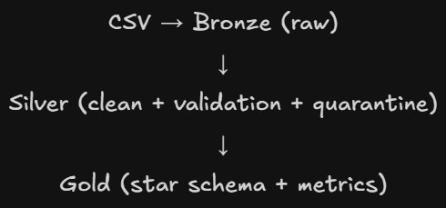

# 📊 End-to-End Data Pipeline (Microsoft Fabric)

## 🚀 Overview

This project builds an end-to-end data pipeline using Microsoft Fabric, transforming raw transactional data into structured analytical datasets for business insights.

---

## 🏗️ Architecture

The pipeline follows the Medallion Architecture:

* **Bronze Layer**: Raw data ingestion (CSV → Parquet)
* **Silver Layer**: Data cleaning, validation, and quarantine handling
* **Gold Layer**: Business aggregation and dimensional modeling (Star Schema)

---

## 🔄 Data Flow

CSV → Bronze (raw) → Silver (clean + validation + quarantine) → Gold (analytics + star schema)

---

## 🧠 Data Processing

### Bronze

* Ingest raw CSV data
* Store as Parquet
* Partition by ingestion date

### Silver

* Filter invalid records:

  * Remove failed orders
  * Validate feedback score (1–5)
* Handle null values
* Store invalid data in quarantine tables

### Gold

* Join sales with exchange rates
* Convert revenue to VND
* Aggregate KPIs:

  * Monthly revenue
  * Promotion effectiveness

---

## 🧩 Data Modeling (Star Schema)

* **Fact Table**

  * `fact_sales`: revenue, order metrics

* **Dimension Tables**

  * `dim_product`
  * `dim_location`
  * `dim_date`

---

## 📐 Schema Design

Example schema (Silver layer):

* order_id: string
* order_date: date
* total_amount: double
* order_status: string
* feedback_score: integer

---

## ⚙️ Data Quality Handling

* Null value filtering
* Invalid record isolation (quarantine)
* Business rule validation
* Data consistency checks

---

## 🛠️ Tech Stack

* Microsoft Fabric
* PySpark
* Data Factory Pipeline
* Delta Lake / Parquet
* Mermaid / Draw.io

---

## ⚠️ Limitations & Improvements

* Incremental processing not fully implemented
* No monitoring/alerting system
* Future improvements:

  * Add incremental load (append + deduplication)
  * Implement pipeline monitoring
  * Optimize Spark configurations

---

## 👤 Author

* Lany - Lam Kim Ngan

